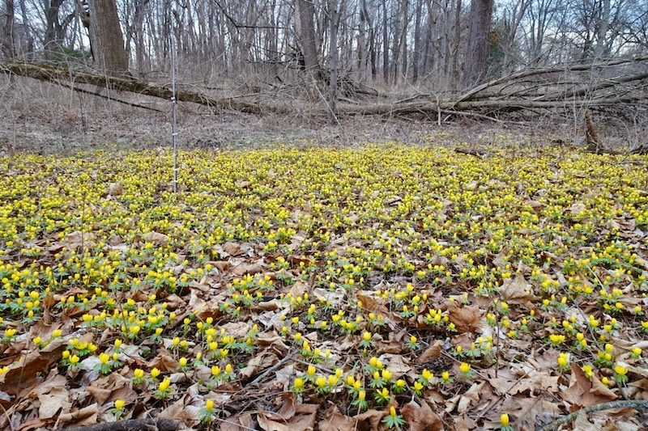

# RAVEN'S NEST

\+ 渡鸦巢 welcome, my friend +

      


#### + latest | [all](archive.qmd) +

::: {#latest}
:::

#### + explore +

\+ I've been constantly updating my birding blog... [**Check it out!**](personal/nd_birding/index.qmd)

[Work](work.qmd){.button} [Personal](personal.qmd){.button} [Archive](archive.qmd){.button}

[Log\|Credit](log.qmd){.button} [About](about.qmd){.button} [Gallery](gallery.qmd){.button}

[Email](mailto:cosmicraven0530@gmail.com){.button} [RSS](index.xml){.button}

<center>


 spring for us: invasive flowers and invasive human beings

</center>

```{=html}
<script>NekoType="black"</script>
<h1 id=nl><script src="https://webneko.net/n20171213.js"></script><a 
href="https://webneko.net">Neko</a></h1>
```
