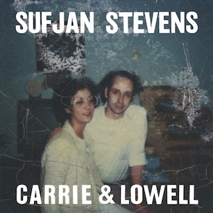
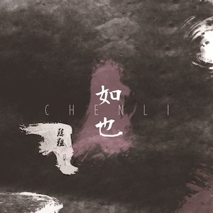

## 冬日电台

### 音乐与我的冬天

-   一月: 做了0件事。或许用黑豹的Don't Break My Heart泡别人算是一件事。

-   二月: 做了0件事。本来计划去看杯糕结果没去成。

-   三月: 刚刚开始，但因为春天来了我觉得一切都会好起来的——虽然做了0件事，但就这么相信着！

### 我的冬日专辑

#### [Olivia Rodrigo - GUTS](https://music.apple.com/us/album/guts/1694386825)

::: column-margin
{group="cover"}
:::

*‘I forgive and I forget/I know my age and I act like it’*

给我来一点不属于我的青少年勇气去面对感情生活。

***推荐曲目：**all-american bitch/get him back!/bad idea right?*

#### [Sufjan Stevens - Carrie & Lowell](https://music.apple.com/us/album/carrie-lowell/955572616)

::: column-margin
{group="cover"}
:::

*‘My little hawk, why do you cry/Tell me, what did you learn from the Tillamook burn/Or the Fourth of July/We're all gonna die’*

内心的一部分在哀悼一些无可挽回地改变了的事物。

***推荐曲目：**Should Have Known Better/Eugene/Fourth of July*

#### [陈粒 - 如也](https://music.apple.com/ca/album/%E5%A6%82%E4%B9%9F/1413542639)

::: column-margin
{group="cover"}
:::

*'你背对着山河一步步走向我/你脚踏着山河一步步走近我/你打开了我的躯壳/你唤醒了我的耳朵/带走我'*

陈粒女同时候。真的是用整个身体和灵魂在爱，歌声就像一桶冷水一样从脊背浇下去。

***推荐曲目：**祝星/奇妙能力歌*
