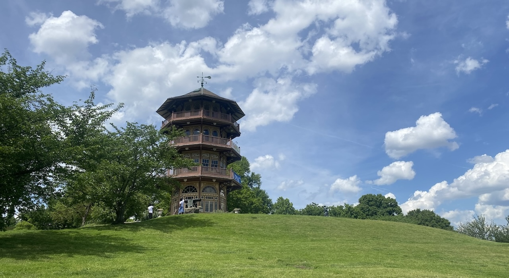

[巴尔的摩系列](../../archive.qmd#category=baltimore)的第三篇是相对轻松的遛弯指南。

我很喜欢散步，本科期间基本每周都要在学校的小池子或者邻近的森林公园逛上一个小时再回去。可惜，以中国城市的标准来衡量，我目前住过的美国城市几乎都与“步行友好”无缘：要么没有人行道，要么有人行道，但是人在街上会觉得背后凉凉的。目前在的中西部大学城属于前者，巴尔的摩属于后者。不过，只要你既没车又闷得慌，再不适宜步行的城市也能被走出几条路来。

正如[前篇](../260117_travel_baltimore_music/index.qmd)所言，巴尔的摩以糟糕的治安臭名昭著，但也有相当丰富独特的本地文化。大家无论是居住在巴尔的摩，周末想要放风，还是出于一些原因要来这里停留两天，想稍微在本地玩玩，都可酌情参考本篇指南。

## 分裂的城市

由于复杂的历史原因，现在的巴尔的摩是一个非常分裂的城市。摩根州立大学的教授Lawrence Brown提出了非常形象的[“两个巴尔的摩”概念](https://www.religionandcities.org/hope-baltimores)——白人聚居的“L”形区域以两条南北贯穿的街道Saint Paul St和Calvert St为中心，向东延伸到港口周围的Fell's Point和Canton；黑人聚居的“蝴蝶”形区域则散落在城市的东西两端。结构性歧视（主要是房产歧视）等历史原因导致这两个区域的安全程度差别很大。

> 'The white neighborhoods on \[the city’s racial mapping\] that form the shape of an ‘L’ accumulate structured advantages, while Black neighborhoods, shaped in the form of a butterfly, accumulate structured disadvantages. Baltimore’s hypersegregation is the root cause of racial inequity, crime, health inequities/disparities, and civil unrest.'
>
> ‘在种族分布图中，巴尔的摩呈‘L’型分布的白人社区不断积累结构性优势，而呈‘蝴蝶’状的黑人社区则在承受结构性劣势的积累。巴尔的摩的极度种族隔离是种族不平等、犯罪、医疗不公以及社会动荡的根源。’

**一言以蔽之，一个人的话最好还是在这个“L”形区域内呆着，尽量不要独自在东/西巴尔的摩的“蝴蝶”形区域内行走。**——虽然“L”形区域内也时有危险事件，并且有时这个街区一片祥和，下一个街区气氛就变得不妙起来了。随时保持警惕。[但其实呆久了就麻木了（别学）。]{.blur}

；可以看到巴尔的摩的贫困率/社会经济地位在地域上极度不平等。](figs/bal1.jpg)

### 巴尔的摩市vs.县

当我们说中文“巴尔的摩”的时候，一般指的是“巴尔的摩市（Baltimore City）”。巴尔的摩市被范围更广的巴尔的摩县（Baltimore County）包围，后者内部有留子最爱的Ellicott City（[前篇](../260124_travel_baltimore_railroad/index.qmd)提到过，这就是美国第一条铁路所在的地方），Towson等小镇，长得就和美国大地上无数个郊区小镇一样，有Mall和中餐韩餐馆等，可供吃喝玩乐。需要注意的是巴尔的摩市是一个独立城市（Independent city），并不隶属于巴尔的摩县，以至于两者并不共享税率，政府，基建等等；可以感受到的就是开车开出巴尔的摩市范围后路况有变好。

此篇博客主要讨论的是巴尔的摩市内的遛弯路线。因为博主在东校区上学所以以Inner Harbor/Downtown周围的路线为主，基本都是霍普金斯的校车系统['Blue Jay Shuttle'](https://jhfre.jhu.edu/ts/transportation/shuttle-services/)能够到的地方。

### 街头智慧

想要在巴尔的摩全身而退，我们需要进化出一点街头智慧。博主的经验是：**不要乱凑热闹**；**不要在有浓重大麻味/电线上有绑在一起的运动鞋/建筑门窗封死/没有人慢跑锻炼的地方停留**；尽量不要与他人有眼神接触；别回应奇怪的人的搭话；减少在公共场合掏出手机的频率；别灵机一动探索未知的房子/街道；别把重要个人物品落在车里。这里的黑帮基本上不会主动招惹学生和外国人，只要保持机警，巴尔的摩的生活其实也没那么惊心动魄。

## 遛弯路线

### 地图

```{r leaflet, echo=FALSE, warning=FALSE, message=FALSE}
library(leaflet)
library(htmltools)
library(sf)
library(dplyr)
library(htmlwidgets)
library(tidyr)

library(leaflet)
library(htmltools)
library(sf)
library(dplyr)
library(htmlwidgets)
library(RColorBrewer) # 1. 必须加载这个包

nodes_local <- read.csv("baltimore_nodes.csv")
paths_local <- readRDS("baltimore_paths.rds")

popup_css <- tags$style(HTML("
  .leaflet-popup-content-wrapper, .leaflet-control-legend {
    background: rgba(255, 255, 255, 0.7) !important;
    box-shadow: 0 0 15px rgba(0, 0, 0, 0.2);
    border-radius: 8px; /* 稍微现代一点的圆角 */
    font-family: 'Comic Sans MS', cursive, sans-serif;
  }
"))

# 使用 CartoDB.Positron 配合 Set2，简直绝配
map <- leaflet() %>%
  addProviderTiles(providers$CartoDB.Positron) %>% 
  addControl(html = popup_css, position = "topleft")

route_names <- unique(nodes_local$route_group)

# 2. 核心修改：生成 Set2 调色板
# 我们确保颜色数量和路线数量一致（最多8个）
n_routes <- length(route_names)
if (n_routes > 8) {
  # 如果超过8个，使用 Set2 的 8 个颜色循环，或提示用户
  warning("Set2 only has 8 colors. Some routes will repeat colors.")
  route_colors <- colorRampPalette(brewer.pal(8, "Set2"))(n_routes)
} else {
  route_colors <- brewer.pal(n_routes, "Set2")
}

for (i in seq_along(route_names)) {
  r_name <- route_names[i]
  
  # 这里可以把 opacity 调高到 0.9，因为 Set2 比较柔和
  map <- map %>%
    addPolylines(data = paths_local %>% filter(route_group == r_name), 
                 color = route_colors[i], 
                 weight = 4, opacity = 0.9, group = r_name) %>%
    addCircleMarkers(data = nodes_local %>% filter(route_group == r_name), 
                     lng = ~long, lat = ~lat, popup = ~name, 
                     color = route_colors[i], # 边框颜色也改
                     stroke = TRUE, fillColor = 'white', fillOpacity = 1, 
                     radius = 5, group = r_name)
}

map %>%
  addLayersControl(
    overlayGroups = route_names, 
    options = layersControlOptions(collapsed = FALSE)
  ) %>%
  onRender("
    // ... JS 代码保持不变 ...
    function(el, x) {
      var updateLayers = function(check) {
        var inputs = el.querySelectorAll('.leaflet-control-layers-overlays input');
        inputs.forEach(function(input) {
          if (input.checked !== check) {
            input.click();
          }
        });
      };

      var container = el.querySelector('.leaflet-control-layers-list');
      var btnDiv = document.createElement('div');
      btnDiv.style.marginTop = '10px';
      btnDiv.style.paddingTop = '5px';
      btnDiv.style.borderTop = '1px solid #eee';
      btnDiv.style.display = 'flex';
      btnDiv.style.gap = '5px';

      var createBtn = function(text, check) {
        var btn = document.createElement('button');
        btn.innerHTML = text;
        btn.style.padding = '2px 5px';
        btn.style.fontSize = '11px';
        btn.style.cursor = 'pointer';
        btn.style.border = '1px solid #ccc';
        btn.style.borderRadius = '3px';
        btn.style.background = '#f8f9fa';
        
        btn.onclick = function(e) {
          e.preventDefault(); 
          updateLayers(check);
          return false;
        };
        return btn;
      };

      btnDiv.appendChild(createBtn('All', true));
      btnDiv.appendChild(createBtn('None', false));
      container.appendChild(btnDiv);
    }
  ")
```

很多路线都连在一起，可以根据体力酌情组合。

::: column-margin
**安全程度**

基于博主的主观感受。

5★：可以一个人安心走路和休息

4★：可以一个人安心走路

3★：部分路段有可疑人物，但还能走

2★：部分路段*感觉很不妙*，别一个人去

1★：不会推荐这种路线的lol
:::

### 内港环线

-   **路线**：Marriott Harbor East -\> Institute for Marine & Environmental Technology (IMET) -\> National Aquarium -\> Rash Field Park -\> Federal Hill Park

-   **推荐程度**：★★★★★

-   **安全程度**：★★★★☆

-   **步行时间**：1-2小时

-   **宜**：一年四季都好

大西洋的海风吹到Inner Harbor时已经变得非常温和，这条路线天气好的时候是非常宜人的。**National Aquarium**非常值得一去，建筑和展览都做得很好，还可以摸摸水母；几个码头之间做了生态浮岛，会有鸬鹚、海鸥停留；数支战舰停放在港口，有的可以进去参观；显眼的五角形大楼World Trade Center Baltimore是建筑师贝聿铭的作品。Inner Harbor在冬天会开放**德国圣诞村**和**溜冰场**，可以去喝热红酒、吃德式香肠（Irish Coffee极其难喝）。**Federal Hill Park**上有美国国旗诞生地的纪念碑和南北战争时的炮台，还可以俯瞰整个Inner Harbor的建筑，夏夜时分非常美丽，我很喜欢去。Rash Field Park时不时会开亚洲美食节。Federal Hill周围还能找到不错的冰激凌店、中餐馆和酒吧。

{group="grp"}

### 港口东部线

-   **路线**：Marriott Harbor East -\> Whole Foods Market -\> Fredrick Douglass-Issac Myers Maritime Park -\> Thames St -\> Fell's Point Farmer's Market

-   **推荐程度**：★★★★★

-   **安全程度**：★★★★★

-   **步行时间**：1-2小时

-   **宜**：暮春傍晚，欣赏蓝调时刻

这是我最喜欢的线路，基本上就是沿着Baltimore Waterfront Promenade前进。一路上码头林立，桅杆交错，绿头鸭和加拿大鹅在岸边慢悠悠地漫步。Little Italy有好吃的海鲜餐厅Mo's Seafood、意大利餐厅Amicci's和可丽饼店Crave。Four Seasons酒店前面的露台是观景的好地方，在**Fourth of July**的时候可以坐在这里看内港的无人机和焰火表演。Whole Foods前面的Lancaster Street风景特别优美，可以坐在那里看海鸥一下午。绕过Central Avenue和Point Street的绿地（周围都是高级公寓）就到了Thames Street。**Maritime Park**值得一逛，那里有海事博物馆和Frederick Douglass的纪念雕塑，旁边的码头时常有人举办婚礼；也可以乘坐免费的游艇Harbor Connector去到港对面的Locust Point。虽然Locust Point没啥好玩的（或许除了著名的海鲜餐厅L.P. Steamer's），但坐船的过程蛮有趣，可以看到海鸥和鸬鹚在海面上飞。Thames Street有不错的唱片店[Baltimore Sound Garden](../260117_travel_baltimore_music/index.qmd#the-sound-garden)，经常会举办一些文艺活动，可以关注他们的Instagram来参与；还有纹身店和**冰激凌店Pitango**——开心果味的冰激凌超好吃。Fell's Point周围还有不少酒吧和餐厅， 每周都会举办Farmer's Market，夏天还有集市，周围的纪念品店可以买到金莺队和爱伦坡的周边。总之，一级推荐。

{group="grp"}

### 医学院下班摸鱼线

-   **路线**：Johns Hopkins Hospital -\> Ministry of Brewing -\> Patterson Park -\> Fell's Point Farmer's Market

-   **推荐程度**：★★★★☆

-   **安全程度**：★★★☆☆

-   **步行时间**：3小时

-   **宜**：春季看樱花和玉兰，迁徙季看鸟

如题所示，这是医学院同学们下班摸鱼的线路。因为会穿过一部分East Baltimore的街道，所以不是特别安全，但总体还不错。从Wolfe Street向南前进到Butchers Hill，路边的景色就变得令人放松起来。Ministry of Brewing——一座由教堂改造成的酒吧/餐厅——是我PI最喜欢的地方，每次实验室要举办什么活动，他都会让我们去那里喝酒庆祝。从那条路往东就能走到**Patterson Park**，它是一片相当巨大的人造绿地，风景谈不上优美，但在那里听听鸟鸣、喂喂鸭子，还是蛮让人愉快的。Patterson Park南边的Eastern Avenue上能看到St. Michael the Archangel Ukrainian Catholic Church，有东正教式样的洋葱头型金顶，很特别。沿着Eastern Avenue一路向西可以走回到Fell's Point；也可以往东走到Canton，那里有不少很好吃的海鲜餐厅。

{group="grp"}

### 爱伦坡线

-   **路线**：Lafayette Monument -\> N Howard St -\> Lexington Market -\> Edgar Allan Poe Grave/Westminster Cemetery

-   **推荐程度**：★★★★☆

-   **安全程度**：★★☆☆☆

-   **步行时间**：1小时

-   **宜**：都适合，冬季可感受哥特氛围

未来想专门写一篇讲爱伦坡，这里就一笔带过。总之爱伦坡粉丝不可错过，很寂寥也很有美感的一个地方，周围的建筑和涂鸦也很有特色。就是最好别一个人走这条路，N Howard Street周围有毒贩出没。

{group="grp"}

### MICA线

-   **路线**：Penn Station -\> University of Baltimore -\> Lyric Baltimore -\> B&O Slope Park -\> Maryland Institute College of Art -\> Decker Library -\> MICA Store

-   **推荐程度**：★★★☆☆

-   **安全程度**：★★★★★

-   **步行时间**：0.5小时

-   **宜**：春季看樱花，秋季看红叶

MICA/火车站周边。有不少当地学生爱去的咖啡馆和餐厅，轻轨站和铁架桥都很漂亮，学校的建筑也很有特色。旧Mount Royal站的大草坪有几课非常美丽的樱花树，三月份简直美得如梦似幻。

{group="grp"}

### Mount Vernon线

-   **路线**：Penn Station -\> N Charles St -\> Mount Vernon Place United Methodist Church -\> Washington Monument -\> George Peabody Library

-   **推荐程度**：★★★★☆

-   **安全程度**：★★★☆☆

-   **步行时间**：0.5小时

-   **宜**：春季看樱花和玉兰

巴尔的摩下城区的中心，华盛顿/拉法叶纪念碑所在地。**George Peabody Library**是老网红景点了，可以进去参观，非常美丽，但并不每日开放；Peabody Institute楼下有供学生使用的排练室，时不时也会举行向公众开放的音乐会。Mount Vernon Place United Methodist Church造型非常特别，砖块是深绿色的，有哥特式的玫瑰窗，尖刺般的塔楼直指天空，在深秋夜晚的寒风中有一种魔戒中Minas Morgul般的即视感。冬季华盛顿纪念碑会挂下彩灯，夏季这里会举办**Flower Mart**，彩旗飘飘，鸟语花香，氛围非常好。旁边的意大利餐厅Sotto Sopra很正宗很好吃，还有歌剧表演可以看。

{group="grp"}

### 城区线

-   **路线**：George Peabody Library -\> N Charles St -\>Baltimore City Hall -\> Inner Harbor

-   **推荐程度**：★★☆☆☆

-   **安全程度**：★★★☆☆

-   **步行时间**：0.5-1小时

-   **宜**：秋季看银杏

比起其他美东大城市的downtown/city hall周边，巴尔的摩的下城区实在是有些乏善可陈。主干道周围有一些历史建筑和古着店，秋天银杏叶落一地还是很好看的。博主走这条路纯粹是想试试靠脚从Penn Station走到Inner Harbor的感觉。

{group="grp"}

### JHU主校区-Hampden线

-   **路线**：JHU Homewood Campus -\> Wyman Park -\> W 36th St

-   **推荐程度**：★★★★☆

-   **安全程度**：★★★★★

-   **步行时间**：2小时

-   **宜**：一年四季都好

与医学院相比，霍普金斯的主校区非常安宁美丽。校园南边有Baltimore Museum of Art。从校园西边绕出去可以走到Wyman Park，里面有小山和小溪，遛狗的人很多，可以实现大家在巴尔的摩hiking的愿望。听说春天的时候这里有很多重瓣樱花盛放。继续往西走就能到达**Hampden**，是一个宁静的街区，里面有不少好吃好玩的，很多本科生都喜欢来这里度过夜晚时光。The Food Market的生蚝相当好吃，Ekiben的韩式烤肉馒头是不少人的最爱，而我最想念的是Kandahar Afghan Kitchen，那手抓羊肉饭的味道简直和国内的新疆餐厅一模一样，量也给得很足。想吃顿好的、喝点好的，这里是首选。

{group="grp"}

------------------------------------------------------------------------

如上所述，此篇文章凝聚了博主两年不到时间内的吃喝玩乐精髓。如有遗漏，敬请各位巴村朋友不吝赐教。
