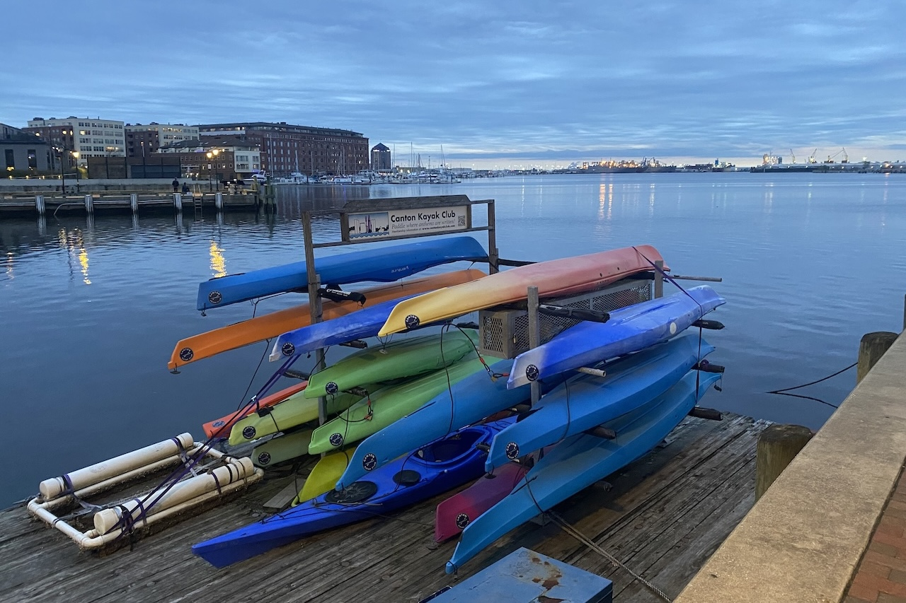

> "**Shivers** Raise the hair on your neck. Tune in to the city.
>
> Cool for: City Lovers, The Wisest of the Street Wise, The Genuinely Supra-Natural"
>
> “**天人感应** 竖起脖颈汗毛。倾听城市之音。
>
> 适合：城市爱好者；街头浪子中的精英；真正的超自然存在”
>
> \- Disco Elysium

去年十月一个人去看了电锯人剧场版。

苏联训练的间谍炸弹人蕾塞要杀死电次，带走电次的电锯人心脏。蕾塞伪装成普通的咖啡店打工女高和电次约会。她问电次，你要当乡下的老鼠还是城里的老鼠？城里机会多，但是会被猫吃掉，被车撞死；乡下的生活很平静，却也没什么值得兴奋的事情会发生。电次说，我要当城里的老鼠，果然还是要生活在城里赚钱吧，并且在城里可以和上司玛奇玛小姐约会（大意）！蕾塞心里想当的是乡下的老鼠。大战后蕾塞卸下伪装，说自己执行任务失败了，以后只能逃亡了。电次说我可以和你私奔。蕾塞拒绝了，但站在月台还是没能狠心坐上离开城市的火车，还是忍不住去平常打工的咖啡店找电次。电影的最后蕾塞被在暗巷里埋伏的玛奇玛杀死。

乡下的老鼠/城市的老鼠是经典的伊索寓言故事，小时候在新东方学英语，老师也让我们做过这个故事的presentation。虽然当时的注意力全放在用油画棒画老鼠的衣服上了，我给城市老鼠画了西装，乡下老鼠画了三层蛋糕裙。当时是2010年，2021年我用谷歌搜自己名字还能搜到当年老师的新浪博客，现在不知道在哪一次搜索引擎优化后消失在网络的洪流中了。天啊，为了自己的新东方学员写一整篇图文并茂的新浪博客，这到底是多热爱自己的工作才会这样。

![**故弄玄虚** [传奇:成功] - \*这个世界不存在出路\*。*位置：Peabody Institute*](figs/meme1.jpg){width=60%}

说到老鼠就又会想起巴尔的摩。巴尔的摩的房子里会有灰色的小老鼠，街上会跑黑色的大老鼠，Fell's Point街上看到过老大一只，穿过整个街道钻进树下面的雨水收集管道里，奔跑的时候尾巴摆成一个波浪形。

![**博学多闻** [中等:失败] - 我都忘了John Eager Howard雕像长得这么像Horseback Monument。 **标新立异** [简单:成功] - 不过估计这个世界上大多男人与马的雕像都长这样。来源[Reddit](https://www.reddit.com/r/baltimore/comments/1gucups/someone_improved_the_statue_in_washington_place/)。 ](figs/reddit1.jpeg){width=60%}

我是城里的老鼠还是乡下的老鼠？之前是不知道的，现在搬到乡下大半年，我觉得我是城市的老鼠。美国的郊区化运动是这个国家犯下最大的错误之一。开皮卡出门，去车程1个小时的地方逛Mall，娱乐是请一群人来房子里开party，开的party里small talk是主要活动，这种生活实在太无聊了。我成年前的大多数时光都是在双向一车道的闹市区度过的，喜欢房屋挤挤攘攘的感觉，喜欢路边小餐馆里放着的品味很烂俗的音乐，喜欢铁道交通，喜欢形形色色的居民在街道上擦肩而过。在这儿学校里还遇到一辈子没出过Indiana的人跟我说没去过纽约，因为“大城市太吵太可怕了”。哇，这就是乡下老鼠。内心泛起的不可思议让我愈发意识到自己真的是城里老鼠。这辈子一定要在超级大城市里住两年，再去执行末日来临前的任何隐居计划！——这种程度的城里老鼠。
 

有人说美国的高速路建设让社区与社区之间无法通过穷人能负担得起的交通方式相连，这样就能巧妙地把穷人排除在富人区之外。住在巴尔的摩的时候不懂，去Indy玩的时候才有切实感受，去Ikea、pho店、Eagle Creek都要开车，高速公路边上也没有步行道，城市中心是干净而空荡的，就像还没放进人物角色的城市经营模拟器一样。怎么可能有人在这种地方住得下去？！从小就过着这种生活的人到底会长成什么样啊。

这又让我想到了之前去纽约的Mount Sinai面试的时候。面我的老师听到我来自巴尔的摩，跟我说，Baltimore is great! It's better than DC. 我说How is that possible. 她说DC's Chinatown is fake as fuck, it has McDonald's in it. 我说What are you saying, Baltimore does not even have a Chinatown.（实际上曾经是有过的，就在downtown西边一点的地方。）她笑着说No Chinatown is better than a fake Chinatown。当时没理解，现在感觉稍微懂一点她在说什么了。Indy就给我这种感觉：No downtown is better than a fake downtown。

> "If you walk with Jesus / He's gonna save your soul
>
> You got to keep the devil / Way down in the hole"
>
> \- The Wire

最近在和朋友一起看火线，火线讲的是BPD重案组调查巴尔的摩西区毒品交易的故事，非常好看。看到好多Maryland生活的剪影，在桌上吃用小锤子敲开的蓝蟹，看Orioles比赛，去Little Italy吃Lasagna，吃烤牡蛎。不由得和朋友说我们真的是不知不觉中已经适应了马里兰的生活，离开了还真有点想念。但一想到每天都会被火警和街上的争吵声吵醒（好的时候是被旅鸫的歌声吵醒）就消停了。想想那次地下管道爆炸导致的downtown大停电吧，连续几天日出而作日落而息啊。这就是生活在城市里的代价！但又觉得不应该是这样的。欧洲和中国的城市生活不都还挺靠谱的吗？美国到底为什么会变成这样——还是只有巴尔的摩太夸张。然后又觉得自己也挺假的，离开了那里才分得出闲暇来审美这种生活；住在那的时候每天都想搬走，只有大脑里的神经衰弱是真的。

![**见微知著** [极难:失败] - 处于某些未知的原因，它安静地躺在栏杆边。*位置：Inner Harbor*](figs/meme2.jpeg){width=60%}

又想到瑞瓦肖。想到第一次去Inner Harbor的时候看到一个空酒瓶躺在码头的栏杆边。这难道不是\*非常马丁内斯\*吗？迅速拍下来传了IG story，但又觉得自己这个满地找瑞瓦肖的行为实在太cliche了。现在看了火线又忽然觉得，至少在美国，或许没法找到第二个和巴尔的摩一样这么像瑞瓦肖的城市了。

和巴尔的摩的关系是一种虐恋。乘着校车经过downtown的时候总是在想，这么漂亮的建筑，这么宽敞的街道，这么恬静的码头，这里完完全全有成为一个伟大城市的潜质。但怎么就变成这样了呢？为了寻找一个实际上与我无关的答案就这样看了这么多书和电影。但真想找到这个答案。

有的时候会忍不住觉得老家真好。妈妈是上大学的时候才搬到那座城市的，她总是笑着调侃说我们那儿人的毛病就是去哪里都觉得老家最好，吃的也是老家最好吃，住的也是老家最舒适，省会也不如老家好，上海也不如老家好，出去留学两年镀个金，回来还是在老家做中学老师和体制内公务员。因为这个原因，我时常需要提醒自己别一遇到问题就想飞回老家；一辈子不出市生活真的是我想要的吗？但在外漂泊过着比在老家更差的日子真的是我想要的吗？到底该怎么活呢。到底该怎么活，真是个问题。
