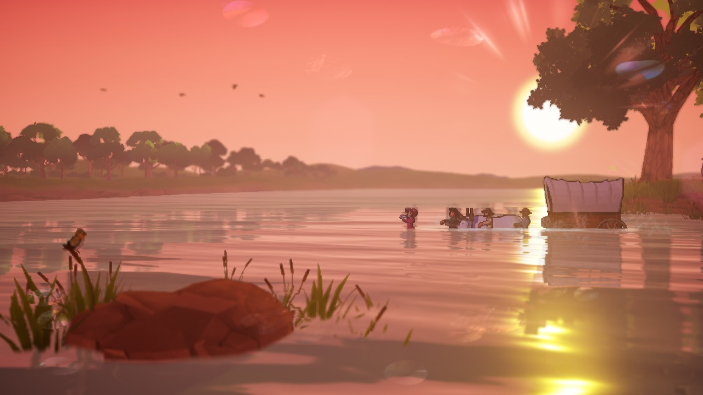
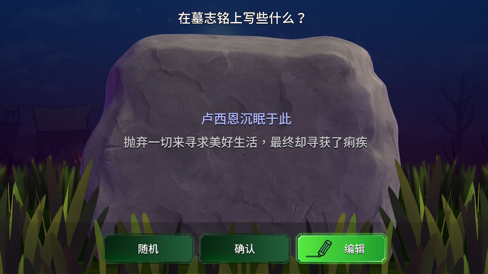
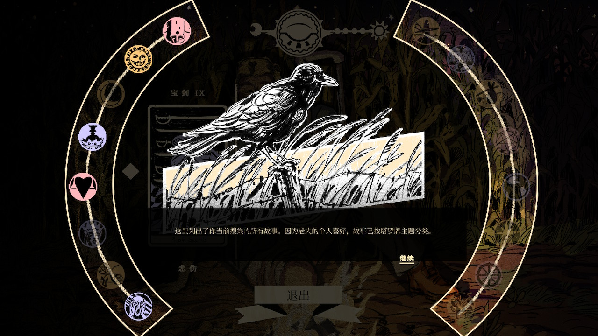
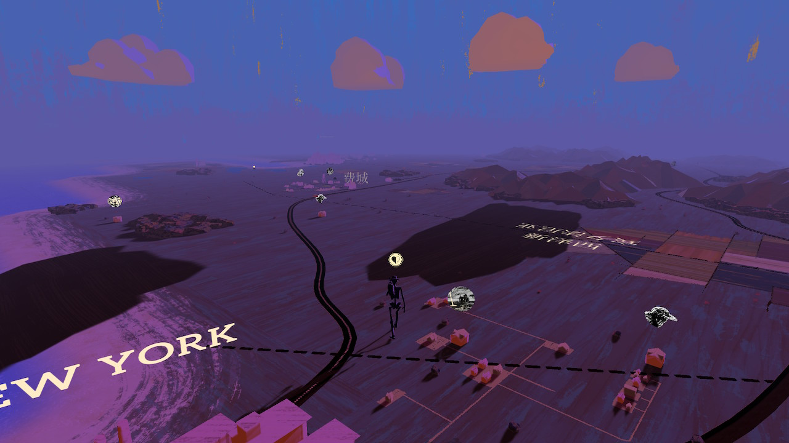

最近有在断断续续地玩一些米国公路旅行主题的游戏，简单写个安利/评测贴。

- **平台**：Nintendo Switch 续航版

---

## [The Oregon Trail/俄勒冈之旅](https://www.nintendo.com/us/store/products/the-oregon-trail-switch)

- **美术**：美丽
- **剧情**：不错
- **玩法**：有趣
- **汉化**：完美
- **评分**：9/10

完美的roguelite游戏，似乎是在游戏史上都赫赫有名的游戏老奶，一开始是做给80年代的美国小学生了解拓荒历史的。

背景是美国19世纪的西部大拓荒，核心玩法是选择四个队友徒步踏上从密苏里州到俄勒冈州的“俄勒冈小径”，一路上要平衡队友的健康、卫生、士气等数值，并面对痢疾、霍乱、步枪走火、蛇咬等随机出现的挑战，食物主要靠打猎和钓鱼获得。作为一个已经把明日方舟当成集成战略启动器的人来说这实在太上头了。除了分为五段的主线任务“俄勒冈小径”以外还有各种钓鱼打猎的小挑战可选，也有支线任务“加利福尼亚小径”等等，但玩了一圈还是感觉主线任务最好玩，其他的有点太简单了，比较无聊。

打完任务可以收集成就解锁各种俄勒冈小径的科普小故事。24年发布的这个版本有咨询原住民，所以里面有很多原住民相关的内容，按照reddit上面的讨论是有“makes it less racist”，毕竟白人的拓荒之旅就是原住民的受压迫史呢……

## [When the Water Tastes Like Wine/彼处水如酒](https://www.nintendo.com/us/store/products/where-the-water-tastes-like-wine-switch)

- **美术**：美丽
- **剧情**：不错
- **玩法**：无聊
- **汉化**：错漏百出
- **评分**：5/10

在小红书上看别人推荐的剧情和美术很不错的公路旅行游戏。

玩下来感觉像个美国众神的同人游戏，玩法几近于无，不过美术和音乐还是可以的，剧情比较零散。主要玩法就是一直走，加入了塔罗占卜的元素。作为一个还是喜欢玩“好玩的游戏”的人来说，这点剧情和美术还是没法支持我一直玩下去……

---

## 展望

还买了大名鼎鼎的[Kentucky Route Zero/肯塔基零号公路](https://www.nintendo.com/us/store/products/kentucky-route-zero-tv-edition-switch)，但因为美区版本没汉化所以暂时懒得打了（请原谅最近没精力啃英文课外内容）；同时正在热切期盼25年的新游戏[Keep Driving/心驰神往](https://store.steampowered.com/app/2756920/Keep_Driving/)登上NS平台中。玩上了就来更新这个帖子。

**公路旅行真好啊！**

P.S. 最近终于把NS从有氧拳击2启动器变成真正的游戏机了，感想是好爽，之前的三年都错付了……比用Mac玩体验好一万倍，甚至在想要不要再补个极乐迪斯科这样我就终于能打完拖了四年的二周目了。但听说极乐迪的NS版本bug很多。
