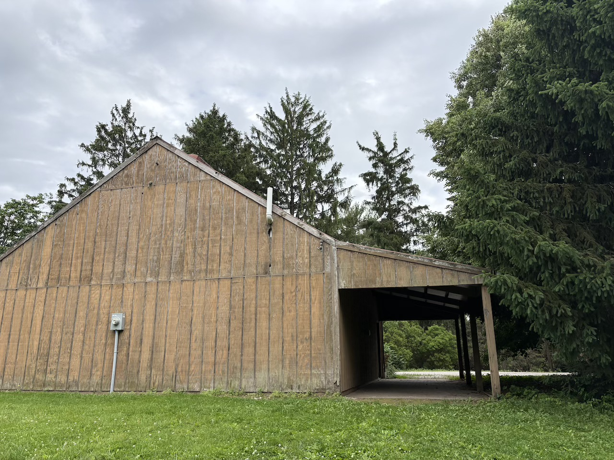
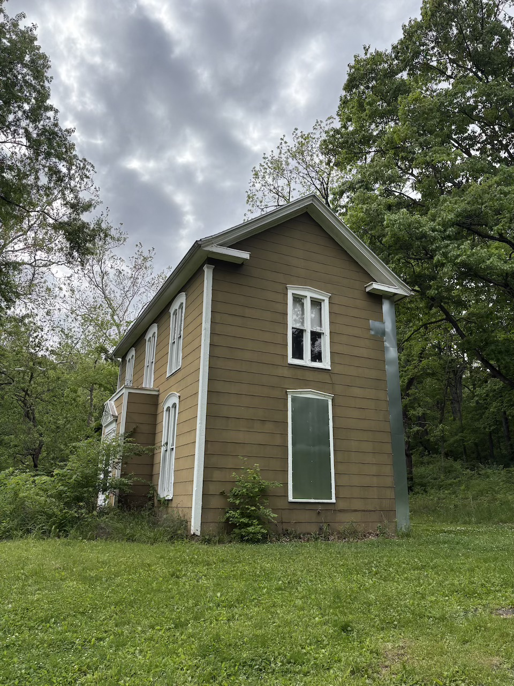

Summer has come - *almost*. 

In west Indiana, it means the sunset time would be around 21:00, which makes it a very good time of year to watch songbirds after work. My target life lists this summer would be the colorful songbirds specific to America, which are - *scarlet tanager, summer tanager, indigo bunting, *and *Baltimore oriole*. 

My bf sent me a pic of a scarlet tanager ('black-winged redbird', as he named it) on a tree which he randomly encountered on his way to work, and it has made me really jealous. As a result, I started going birdwatching from 17:00 to 19:00, and luckily, I've completed half of my list in only three days.

## A Beginner's Guide to Looking for Songbirds

Since I can always somehow find a place near water to live, I mainly watch shorebirds and waterfowls in the past; and since they can swim (obviously), they are much more bolder compared to songbirds. However, I don't really want to go near water during summer - my bloodtype is A, and, that's a feast to mosquitoes. 

As a result, I started to looking for songbirds, and I have gathered some tips over these days.

### 1. Birds are more likely to live on 'edges'.

For some reasons I wasn't sure enough, you can always see more songbirds at trailside compared to some place deep in the forest. Maybe it's because there is more food. However, woodpeckers - especially the larger ones - seem to prefer the deep forest.

### 2. Birds have their territories. 

If you (or your Merlin bird ID) hears a bird near a tree, and you can't find them immediately, don't worry! Walk past it tomorrow, and you might find your target. 

{group='grp'}

### 3. Different birds have different preferences for privacy.

You always see robins, cardinals, starlings, corvids, pigeons and doves, sparrows, and finches on the open ground. They are braver than other birds, and they usually allow you to approach them closer. 

{group='grp'}

Wrens like to hide in the bushes. You need to bow to see them, and they flew away as soon as you stare at them for too long.

Waxwings, mockingbirds, thrashers, and catbirds sometimes jump on the branches of roadside shrubs. They are braver than many other birds, but if you approach them suddenly, they will certainly fly away. 

Pewees, vireos, and orioles are very shy. They usually hide themselves in the leaves of high branches of large trees, and most times you can only identify them by their songs. 

{group='grp'}

### 4. Stand still, and use your Dynamic Visual Acuity to find them.

That's it. Use your DVA. If you find a 'singing' tree, stand still under it and wait for 15 minutes, it's highly likely that you'll find that singing bird. Goldfinches like to fly in pairs, and it's a pleasure to watch those golden little bullets fly over the ground. 

{group='grp'}

### 5. Size and posture matters.

Size and posture really matters when trying to identify a bird in the wild. For example, people often confuse orioles with robins, since they both have a black back and a bright orange belly; but if you know that orioles are much smaller and robins like to walk with their heads held high and chests out, you'll be able to differentiate them immediately.

{group='grp'}

Sometimes you can see large waterfowls and raptors flying overhead, and it's possible to identify them only by the way they fly. For example, cormorants fly by flapping their wings really fast, and if you see some huge bird with its neck retracted, that's almost always a great blue heron. 

## Some Memories

Three days ago, for the first time, I saw a female **red-winged blackbird**. She was an incredibly cute little bird, and her face resembled the male bird in some way. She was diligently pulling algae from the pond. I initially thought I was seeing some kind of American dipper or waterthrush. After discussing with my friends, we confirmed that it's not a new lifer, which was a bit of a disappointment. Then I remembered her mate flying nearby, calling out loudly. Okay, who am I to stop the happy couple from being there? 

{group='grp'}

I also heard some **gray catbirds** meowing, which reminded me of two summers I'd spent on the East Coast before. These light and fluffy gray birds always evoked memories of summer. They are brave birds, almost as large as a robin, and like their relatives, mockingbirds, they can mock other birds' songs. Someone called it 'buzz-cut bird' - okay, that's fair - but I'd like to call it 'nun bird' since I think that small patch of gray feathers on its head looks like a 
nun's hat. 

{group='grp'}

Additionally, I saw a **common nighthawk** flying overhead, with two prominent white patches on its wings. It flew very high; I initially thought it was a chimney swift. In China, we have nightjars - nighthawks' relatives - which have a mating call that resembles a laser gun. The American version does not sound like that. In ancient China, nighthawks were called 'mosquito mother' because of its large beak, and the ancients believed that mosquitoes were spat out by them. 

Speaking of which, I got bitten four times by mosquitoes that day. Even fully covered, going into the woods always comes at a price. The good thing is that we don't have *Aedes* here. Back in my hometown, I have got blisters all over my legs because of *Aedes* bites, and trust me, that's a pain in the ass. 

---

## 'Let's just forget...' 

The scenes in the park are too *emo*.

::: photo-row
{group='grp'}

{group='grp'}
:::
