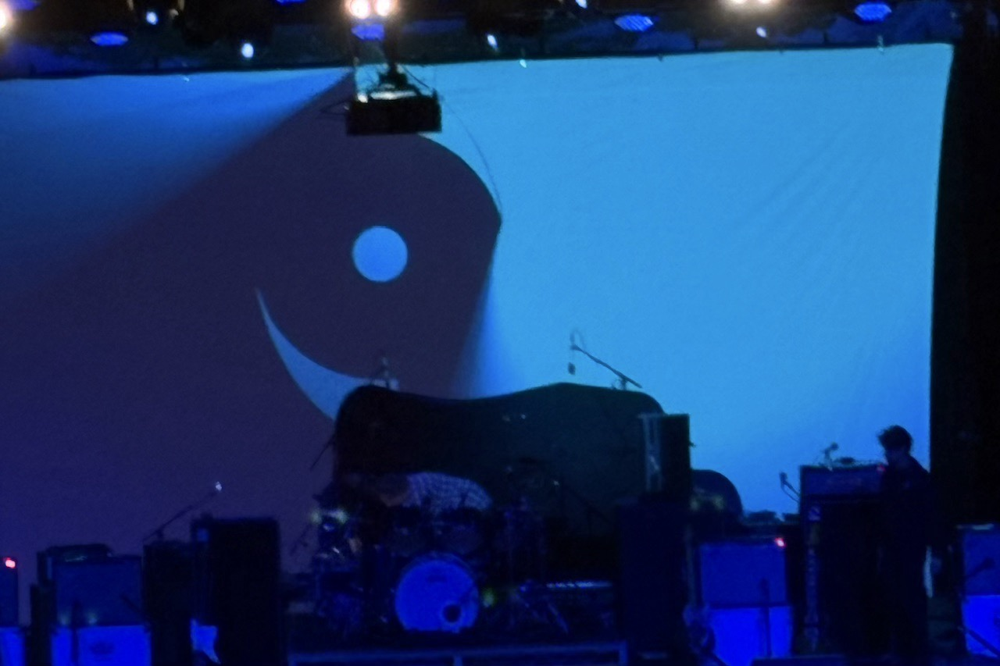
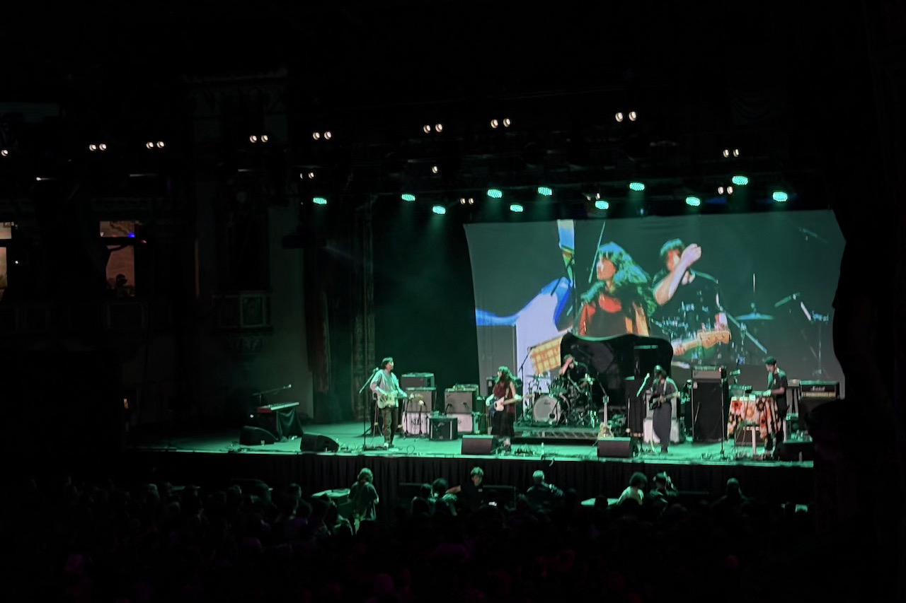
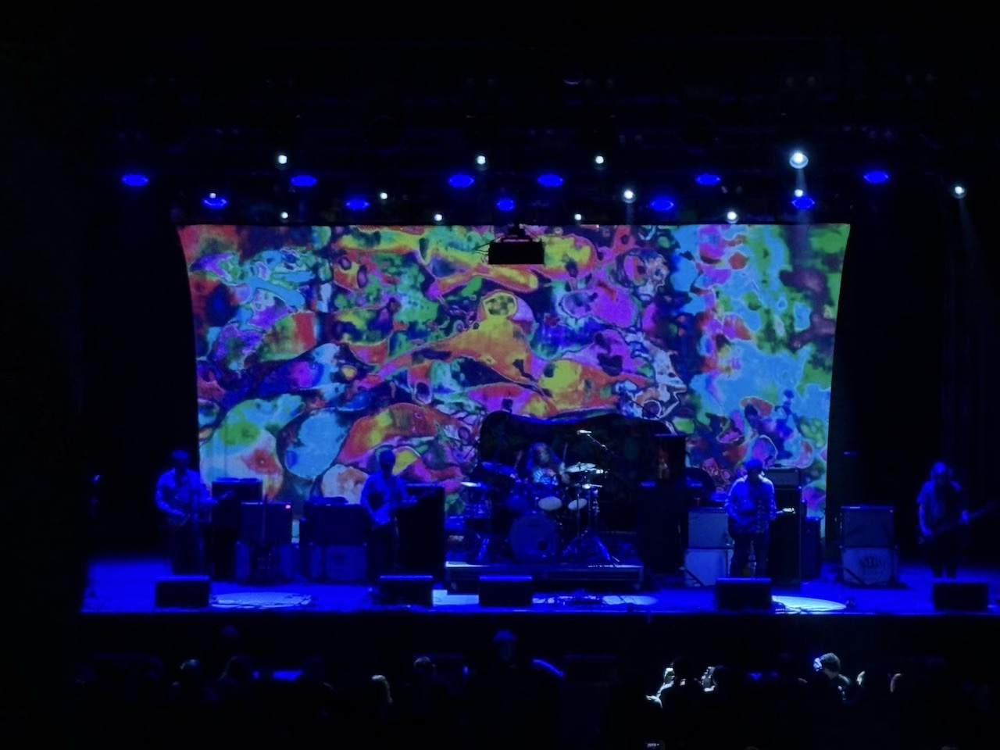
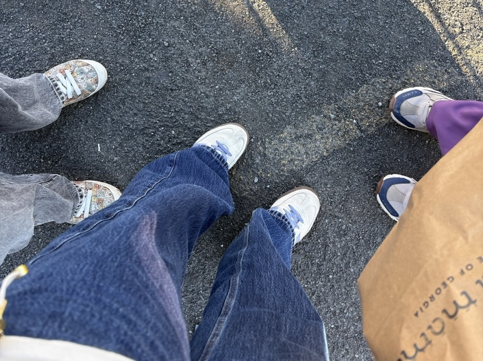
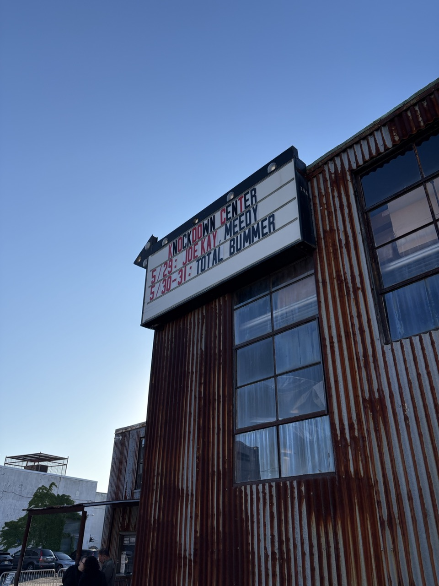
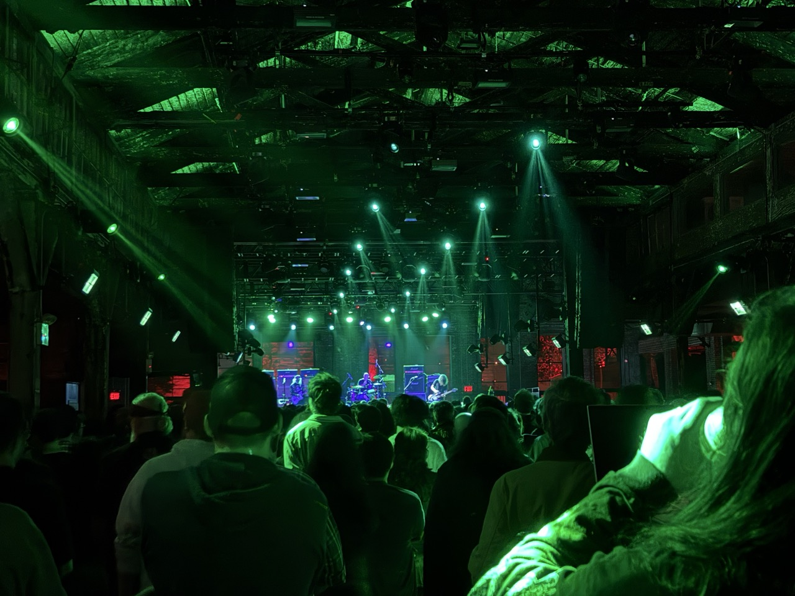

## Slide Away

这个周末终于去了心心念念的[Slide Away Festival](https://www.slideaway.co/)。

{group='grp'}

>'A genre that lends itself to loudness can still be overheard from its origins in the 1980s. Shoegaze, Dream Pop, Ambient, or whatever you may call it, has carried itself gracefully through decades while inspiring countless subgenres and infecting all walks of music along the way. 
>
>The audience reflects back the legacy and continued impact with a feeling of mutual admiration and respect is palpable across generations and identities - no matter the coast.
>
>SLIDE AWAY is a celebration of the genre and all artists who shape sound in the most unique of ways, all the while bridging the gap between the diverse cast of boundary pushing mavericks of yesterday with the genre bending savants of now.'
>
>——Slide Away官网的介绍

这是一个小有名气的美国盯鞋音乐节，24年开始办的，每年一届，一开始是为了庆祝费城和LA的盯鞋场景。主办方似乎是费城盯鞋乐队nothing。前几年的节其实我努努力应该也能去，但因为对领衔乐队的风格不怎么感冒所以搁置了。今年因为有Chapterhouse和Hum，并且开到了芝加哥，我就想，这次一定要去！于是去年九月份就买了票。

芝加哥的Slide Away开在uptown的Aragon Ballroom，场馆大小和DC的The Anthem （slowdive的演出场地）差不多。Uptown给人的感觉和费城的Fishtown很像，很有文艺的氛围，但也有点乱乱的。6点多进门，观众很礼貌，气氛很热烈。因为准备晚上开夜车回去，不能喝酒，所以我们只能喝无酒精饮料。芝加哥物价太贵，最后我们都喝了水。纯纯的白开水，装在啤酒瓶里，取了个唬人的名字叫Liquid Death……就这样无痛融入了喝酒的人群！

看下来最喜欢的居然是第二个表演的芝加哥小乐队[sunshy](https://sunshyily.bandcamp.com/album/i-dont-care-what-comes-next)，他们很年轻，24年才发第一张专辑。现场听起来音效极棒，旋律也写得有意思，对比之下其他乐队甚至都有点黯然失色。表演结束后我们立刻去周边摊买了T恤和场刊（对，他们甚至做了一本场刊），翻开发现居然是简体中文字。[采访](https://music.douban.com/review/17369928/)里主创说不想做90s乐队的单纯模仿者，想融合自己喜欢的其他流派和亚裔在美国的生活经验做新的东西。可能因为这样，他们才管自己的风格叫noise pop，而不是已经有点滥用的shoegaze吧！看得愈发喜欢，遂又回去排了队买了cd。同来的朋友有爱听国盯的，发现专辑附赠的小卡上有他最喜欢的乐队之一天然味道；后来发现他们都签在长沙/深圳的独立厂牌小动物唱片旗下。回家仔细听了专辑，真好听，颇有一些10年代国盯之风，清新诗意带点忧郁。最喜欢的曲子是[On the train](https://sunshyily.bandcamp.com/track/on-the-train)。邂逅喜欢的乐队的感觉真好，可能这就是音乐节的意义吧！

::: column-margin
{group='grp'}

无端联想：我很喜欢的观鸟博主竹雈在有一期记录一年内开过的公路的视频里用了Alcest的[*Souvenirs D'un Autre Monde*](https://alcest.bandcamp.com/album/souvenirs-dun-autre-monde)做背景音乐，就说盯鞋和这种滚滚前进的意象很配吧！

:::

Chapterhouse的表演不错。之前网友总跟我说他们和RIDE是异父异母的亲兄弟，确实能听出来相似之处：旋律是英国乐队一贯的明亮动听，很有pop感；节奏组很强劲，有几首歌有点舞曲味儿。就是人声听起来很苍老了。不过毕竟是老头了，这也是没办法的事。鼓手玩得很嗨，最后一直在一边打鼓一边指挥；主唱看起来头发特别茂密！

::: column-margin
{group='grp'}
:::

大多数美国人似乎都是为了压轴的Hum来的，Hum的周边售卖点排起了长队。但我们因为白天徒步了三个小时已经精疲力竭，还想留点体力安全驾驶打道回府，所以就早退了。事实证明这是一个正确的决策，朋友开的车出城回家，我在副驾驶上尽力保持清醒，已经到了出现幻觉的地步，觉得黑夜里有巨人在行走；而双手紧握着方向盘的朋友意志力已然达到超人级别。第二天都补了觉。下次一定！很想听到现场版的stars。

芝加哥的夜色真美，密歇根湖旁边的大道一看就是精心设计过的。我爱城市生活！

---

## Total Bummer

30号去纽约找朋友玩，看了今年新开的另类摇滚音乐节Total Bummer。

{group='grp'}

音乐节的场馆Knockdown Center很有意思，是一个位于Brooklyn的废弃的玻璃/门框厂房，从Manhattan乘坐L线可达。场馆里有两个舞台，一个室内的main stage和一个室外的舞台the Ruins，乐队在这两个舞台上交替演出，基本不用在那干等换设备啥的；音效非常棒；舞台很大，通风透气，还有很多可以坐下来休息的地方，体验一级甲等。就是在室外的时候会吸到二手烟和麻，以及由于场馆实在太大了，找了一圈都找不到去周边售卖亭的路。非常神奇的是厕所里有attender在递纸和兜售零食矿泉水。老天啊，难道我们没有别的更体面的挣小费方式了吗？

::: column-margin
{group='grp'}
:::

我们来得晚了些，从Teen Mortgage开始听的。Teen Mortgage是个硬核朋克乐队，只有主唱、鼓手两人，但是依然搞出了非常巨大的动静。Blonde Redhead是90年代的纽约乐队，曲风是实验/迷幻系的，鼓点的节奏很特别，主唱的姿态很美，挺喜欢的。回来还翻到了主唱Kazu和Lush的Miki的一个[采访](https://talkhouse.com/kazu-makino-blonde-redhead-and-miki-berenyi-lush-have-a-lot-in-common)。Meat Puppets是来自凤凰城的乐队，风格非常*美国*。挤在抽着各种化学品的人群中看着晚霞在厂房上的反光、听着老头卖力弹琴，也蛮有情调。

::: column-margin
{group='grp'}
:::

Dinosaur Jr的现场非常非常棒。对J Mascis的华丽吉他solo早有耳闻，现场听了，感受真是震撼。鼓和吉他都又强劲又稳，变化多端的旋律穿插着J懒洋洋的声音，非常适合随着音乐摇摆舞蹈……翻唱the Cure的Just Like Heaven和录音室版一样在第二段副歌戛然而止。老头们精力无限，6、7分钟的吉他solo演了一首又一首，人群随着音乐不停蹦跳摇晃，他们在远古时代肯定是非常厉害的萨满吧……
