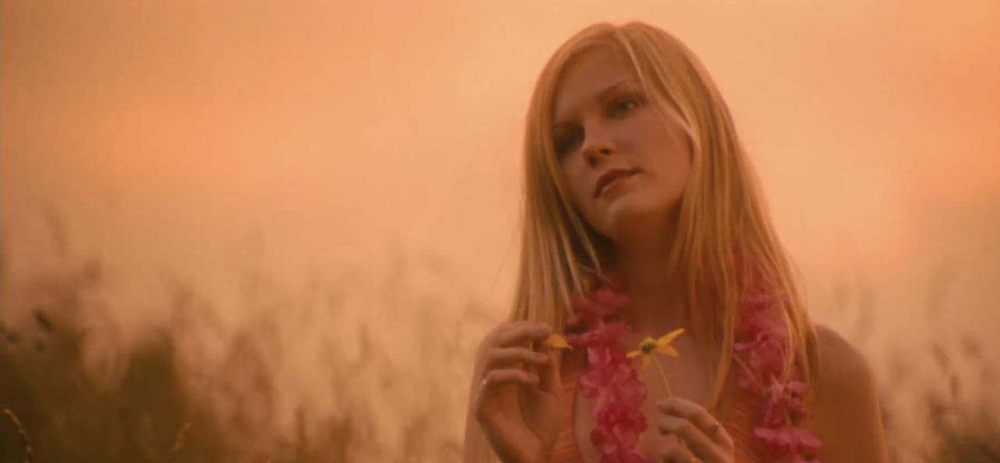
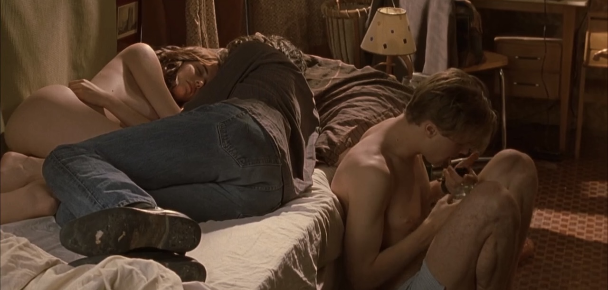
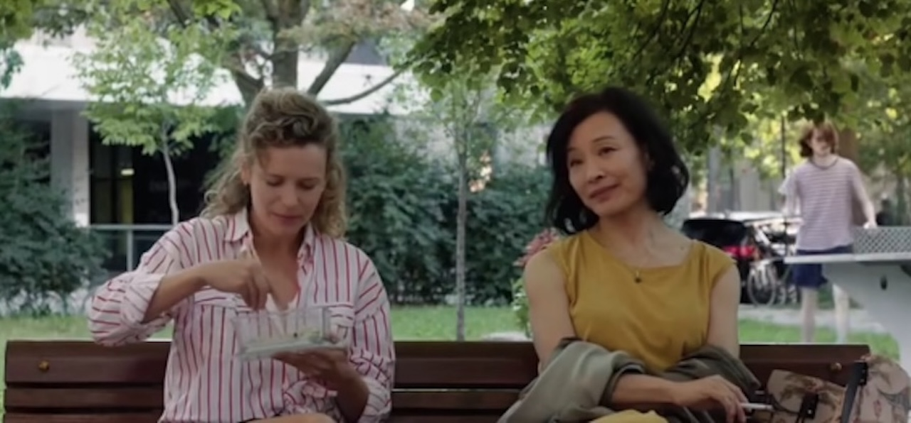

从纽约回来的飞机上在《月光男孩》和《“呼啸山庄”》里犹豫一会儿选择了后者，于是度过了在周围人灼热的注视（并不存在）下看着男女主尬演尬操的坐立难安的两小时。下飞机后我指天发誓，要吃点好的来弥补这两个小时受的精神伤害。——这就是这个夏日爱情片马拉松的起因了：一定要找到我的10分爱情片。遂一口气看了六部电影，居然都不错，来写篇观后感卖卖安利。

<link rel="stylesheet" href="https://cdn.pride.codes/css/bar_helpers.css">

::: callout-warning
剧透预警。部分裸露、自杀提及。
:::

{group="grp"}
---

## 处女之死 The Virgin Suicides

- 导演：Sophia Coppola｜年份：1999｜我的评分：8/10

马拉松的第一步是捡起了之前放着没看完的《处女之死》。之前在小红书上看别人分析Lana Del Rey和Olivia Rodrigo新专的sad girl aesthetic，提到了索菲亚·科波拉的这部电影。两年前看了她的《迷失东京》，很喜欢镜头和配乐，于是自然而然地去看了。这部讲述未成年人自杀的电影算不上是爱情片，但确实有一些青少年爱的成分在里面。

这部电影讲述的是80年代美国东海岸郊区的Lisbon五姐妹的故事，由小妹Cecilia的割腕自杀未遂开始，到姐姐们的相继自杀结束。Lisbon姐妹是数学老师的女儿，家庭氛围压抑而保守。性格敏感、喜欢幻想的小妹痛苦于生活的一成不变和大人们的无聊，决定在浴缸里割腕。被救起来后，家长们给Cecilia办了一个派对让她多认识认识同龄的男孩，希望让她开开心，但派对的虚伪和无聊让Cecilia再次失去了生活的希望，从窗口一跃而下。镜头继续拍摄着余下的四姐妹的故事：第二小的妹妹Lux被学校的橄榄球四分卫Trip Fontaine追求，Trip带着朋友们邀请Lisbon姐妹们参加了学校的homecoming ball。舞会上Trip和Lux被选为舞会的King与Queen，激动的两人遂当晚在球场上发生了关系，早晨Trip却独自离开，留下Lux独自一人。Lux的出格行为导致了家里人对Lisbon姐妹们更深的控制，被禁足的女孩们最终选择一起自杀。

{group="grp"}

看完电影，我最能共情的是13岁的Cecilia。她是一个塞林格小说式的人物：早熟，古怪，痛苦于现实与想象的差距。电影里一直关注着Lisbon姐妹的男孩们在Cecilia死后阅读了她的日记，对她的评价是：“Basically, what we have here is a dreamer... someone completely out of touch with reality, when she jumped, she probably thought she could fly”。心理医生问Cecilia为什么要自杀，你这么小，还没有经历过人生的痛苦。Cecilia说，医生，你从来没当过一个13岁的女孩。……简直就是我的青春期。也把白人中产郊区生活的压抑和虚伪表现得很好，所有的悲剧最后都变成了新闻头条和酒会的谈资，没人真的在乎姐妹们的想法。Trip出场的那一段用了滥俗美高青春片般的镜头语言，但最后换来的是最悲惨的结尾，看得心里闷闷的。

电影的镜头和音乐也非常好。导演选择使用旁观者（男孩们）的视角来讲述这一个故事，没有人真的知道女孩们心里是怎么想的，只留给观众一个侧影。原声是法国Ambient乐团Air的作品。

## 戏梦巴黎 The Dreamers

- 导演：Sophia Coppola｜年份：｜我的评分：9/10

{group="grp"}

## 分手的决心 Decision to Leave

- 导演：朴赞郁｜年份：2022｜我的评分：7/10

## 落叶归根 Getting Home

- 导演：张扬｜年份：2007｜我的评分：9/10

{group="grp"}

## 蒙特利尔，我的美人 Montréal, ma belle

- 导演：和晓丹｜年份：2025｜我的评分：9/10

冷静下来以后觉得分不应该给这么高，但我的mommy issue被陈冲演的凤霞狠狠地激发了出来。女主角凤霞是来自哈尔滨的一代移民，70后，在蒙特利尔和不爱的老公一起开便利店，来这里14年都不能流畅地说法语，去医院看病需要孩子翻译，融入不了当地的生活，把一双儿女当成生活唯一的念想。在下体干涩行房疼痛难忍后她终于决定不再压抑自己从青春期掩藏已久的的情感和情欲，在约会网站上认识了30岁的咖啡馆店员Camille，度过了一个美好的夏天，却又得同时承担背叛婚姻的代价——这样的故事。

{group="grp"}

这么一个有点刻板的设定被陈冲演得活灵活现，里面一些细节特别戳我。女儿的朋友们来家里聚餐时，凤霞夹着烟眯起眼睛看女孩们嬉笑玩乐，少女的长发在绿树掩映下飘舞，如梦如幻；凤霞给Camille示好的方式是给她包了饺子放在一个漂亮的蓝白条纹保温袋里；凤霞和老公刚来蒙特利尔的时候，愿望是去装饰着一大丛花的餐厅里吃饭；凤霞的床头柜里藏着她年轻时和暗恋对象的合影，90年代的女孩们衣着朴素，笑得开朗；凤霞和Camille在街角遇见跳舞的人，Camille自然地融入人群跳舞，凤霞矜持地在一边笑眯眯地站着鼓掌；凤霞走进女儿的房间，抱着她撒娇说想和她一起睡，不要离开她；甚至她对蒙特利尔/加拿大的单纯向往——觉得这里很有活力，很自由，喜欢街头随处盛放的鲜花和有活力的生活——都很“70年代妈妈”。就，我们这些mommy issue患者就好这一口？！看得我完全昏头了。有人说这个年纪的一代移民不会主动在孩子面前提起性、不会上约会网站，所以这个角色是不成立的，我想说老天啊，你们还是太小看老辈子了。Camille的角色反而有些刻板：辍学的人类学学生，也没有太展开，有点遗憾。

在电影里也看到了一些对一代移民身份认同的讨论，比如凤霞去咖啡馆时遇见Camille的女友们，得知凤霞的中国人身份后，一个短发女孩俯身急切地询问凤霞中国对LGBTQ群体的歧视和压制，凤霞尴尬得无所适从，转身就走——这是一个稍显咄咄逼人、并且把凤霞当成中国的话事人而不是“一个人”的问题——这样的microaggression大家应该都很熟悉了；但感觉导演在讲述这些故事的时候有些过于用力了，不够个人、生活化，所以也显得又些超现实，仔细想想有些刺挠。但这一切都被陈冲散发的成熟女人魅力抵消了。床戏也很色。她真适合演这种任性地陷入爱情的成熟女人角色，无论年龄多大了都透露着小女孩的娇憨气息。看完的时候我真心希望凤霞幸福。

## 面子 Saving Face

- 导演：伍思薇｜年份：2004｜我的评分：10/10

作为马拉松收尾的电影，看得心满意足。在《蒙特利尔，我的美人》影评里看到《面子》是陈冲演的另一部Les片（虽然没有演Les）于是兴冲冲地去看了，果然没有失望，非常好看，温情又搞笑。与《蒙》不同的是，《面》讲的是二代移民的故事，年代也更早，自然地就更轻盈乐观，有迪士尼电影一般的特质：真爱至上。

故事线简单又很“老中”：住在纽约的外科医生Wil是女同性恋，但她妈妈不接受这一点，一直给她介绍同龄男孩，还请人给她煎中药调理同性恋。在一次法拉盛的华人聚会上，Wil爱上了19年前有一面之缘的舞者Vivian，但此时家里又突发危机：Wil的妈妈在丧夫N年后又突然怀孕，并且拒绝告诉任何人孩子的爸爸是谁。德高望重的外公倍感丢人，将Wil的妈妈丢出家里，直到妈妈结婚给孩子一个名分前都不会让她回家。妈妈于是暂住到Wil家里。虽然自己丢了大脸，妈妈依然心安理得地在Wil面前扮演一个操心任性的妈妈角色，挑剔她的黑人朋友和女朋友（Wil不敢告诉她，说是朋友而已）；Wil则在生活的夹缝里硬撑。直到最后妈妈要嫁给不爱的人、女友也因为自己的懦弱失望分手的紧要关头，Wil才放下了面子，帮了妈妈一把逃出婚礼现场；妈妈也帮Wil和Vivian再次相见。最后大家肩并肩坐着，接受了一切，美好的未来似乎要开始。就是这样一个萌萌的故事。

看完以后最大的观感就是，真的好萌。Wil有那种迪士尼冒失女主的气质，扎着长长的马尾辫，衣着朴素，在该勇的时候怂怂的，直到心结被解开后才勇敢了起来；自由又性感的Vivian是所谓的引导型爱人，抱着手在自动售货机后面看着Wil的时候太美了，笑眯眯地提醒Wil两人小时候的事（Wil英雌救美的往事也像童话一样萌萌的），还借着教Wil如何在舞蹈中放松地倒下的机会撩她。Vivian在窗台边随意地倒在地上，姿态轻松又优美，镜头扫过Vivian舒展的姿态、自在的微笑和红色吊带上衣下露出的皮肤，Wil看得两眼发直。轮到她的时候Wil浑身僵硬，只能看着Vivian笑着越靠越近，最后怂得啪地倒在地上，最后两个人在地毯上亲嘴……太萌了，老天啊。亲密戏也萌萌的。陈冲演的妈妈依然有《蒙》里把我迷住的老派feminine老妈气息，在女儿面前很任性。准备给妈妈相亲的时候，Wil说你别穿黑裙子，穿这个黄的多好看，妈妈说黄种人穿黄的不是更加成了黄脸婆？Wil不可思议地看着妈妈，意思是那你买这条黄的干嘛？妈妈理所当然地说大甩卖啦。最后妈妈穿着大红色的吊带裙见了相亲对象，女儿睁大眼睛一脸无语。这样的母女相处小细节很多，很贴近现实。非常可爱。带着穿着婚纱的妈妈坐公交逃婚的那一段也非常浪漫。

电影用一种轻盈又温情的态度来处理向保守的家人出柜这个严肃的话题，这一点我也很喜欢。Wil和妈妈的对话是这样的：“妈，我爱你……但我也是gay。”“你怎么可以同时说这样的两句话，一边说爱我，一边伤我的心。”直到最后两方的家长都接受了孩子的取向和爱人，Wil的妈妈还在问，“那你什么时候可以给我生个外孙？”爆笑。结尾停在这一刻我也很喜欢。导演真的很有幽默感。

---

这么一大堆片子看下来感觉取向还是很明显的：我喜欢萌萌的纯情的感情线……怎么办（怎么办

