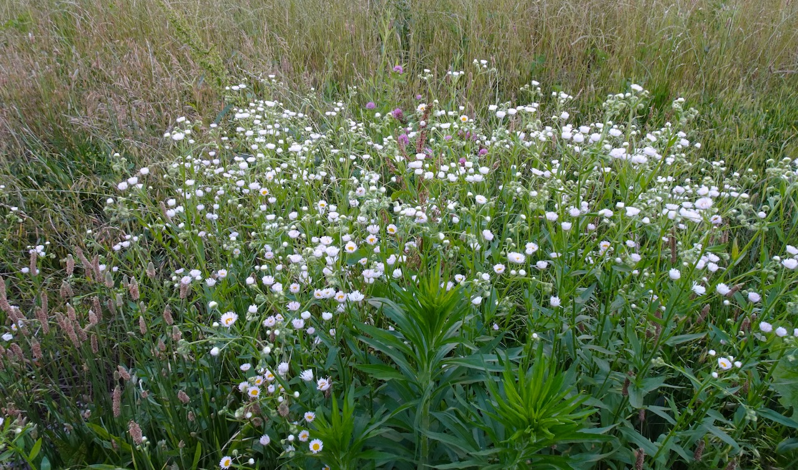
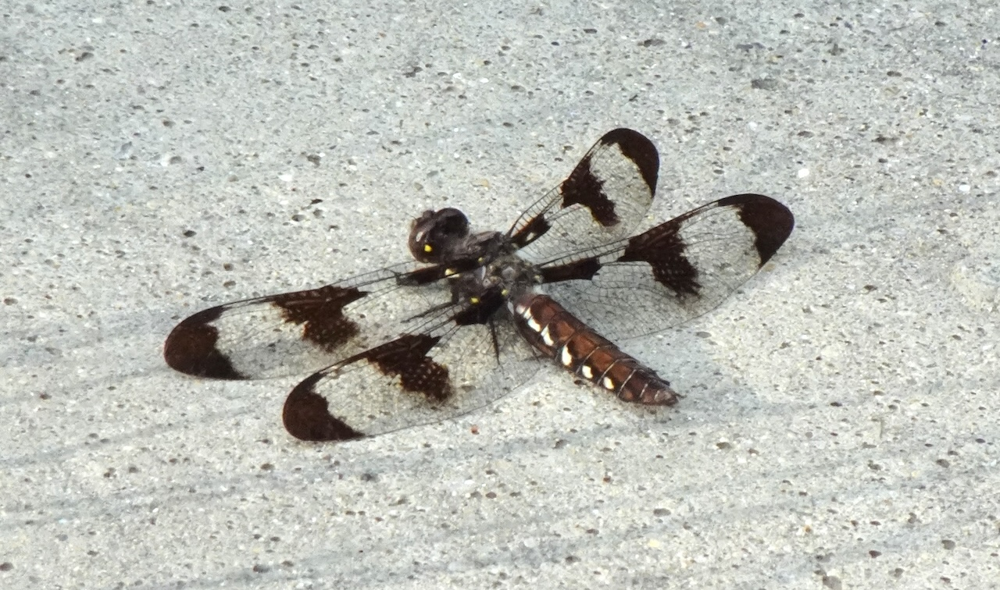

I'm very much interested in the forgotten game day parking lot in front of the Purdue Horticulture Park. Without lawn mowers, the field becomes overgrown and now filled with wildflowers in summer. What kind of wildflowers are they? Are they native or non-native? These are the questions I want to answer in this post. 

I learnt the word 'overgrown' when birding. I want to find dickcissels and bobolinks this summer, since they are typical Midwest summer birds. The field guide says 'look for overgrown fields or tallgrass prairies'. Without a car, it's hard to go to these places - there are no sidewalks in rural Indiana, and last time I tried biking north, I freaked myself out on the biking trail-less McCormick Rd crossings. So, I decide to try my luck on the game day parking lot. Unfortunately, this specific field may not be overgrown enough to fulfill a dickcissel's needs. Still quite beautiful, though; as is written below, it still fulfills a lot of other animals' needs -- I even saw someone taking her maternity shoots there!

---

## Plants

It's surprising that most plants I've found are non-native. 

### Buttercups

{group='dft'}

- non-native, native to Eurasia. Can be [toxic to grazing animals](https://extension.entm.purdue.edu/newsletters/pestandcrop/article/control-of-buttercups-in-indiana-fields/).
- bright yellow blossoms

### Red Clover

{group='dft'}

- non-native, native to Eurasia
- beautiful, look similar to the common white clovers

### Salsify

{group='dft'}

- non-native, native to Eurasia
- looks like a giant dandelion, and is extremely tall
- deer eat them. You can see that in the [last picture](#white-tailed-deer) of this post. 

### Plantain & Fleabane

{group='dft'}

- Ribwort Plantain: non-native, native to Eurasia
- Annual Fleabane: native! Yeah!

### Dyer's Rocket

{group='dft'}

- non-native, native to Asia

### Orange Daylily

{group='dft'}

- non-native, native to Asia
- grows near water, individual blossoms only last 24 hours. 'Hemerocallis' means 'beauty for a day'.

## Animals

::: callout-warning
Close-ups of various kinds of insects.
:::

### Common Whitetail

{group='dft'}

- native
- striking

### Ebony Jewelwing

{group='dft'}

- native
- male iridescent blue, female iridescent brown with small white dots on wings
- fly gently when interrupted, like small pieces of midnight

### Fragile Forktail

{group='dft'}

- native
- very small damselflies

### Giant Ichneumon Wasp

{group='dft'}

- native
- scary with its massive ovipositor, but harmless to humans

### Some kinda Moth

{group='dft'}

- native?
- hard to identify

### White-tailed Deer

{group='dft'}

- native
- dreamy baby, eating [salsify](#salsify) - you can see that flower head dangling near its mouth. Read more on their diet in Indiana [here](https://www.in.gov/dnr/fish-and-wildlife/wildlife-resources/animals/white-tailed-deer-biology/).
- saw their traces on snow during winter

---

I'm also currently reading [Chris Helzer](https://prairieecologist.com/about/)'s *the Ecology and Management of Prairies in the Central United States* to get some idea of this kind of ecosystem. Will share my thoughts when finished!
