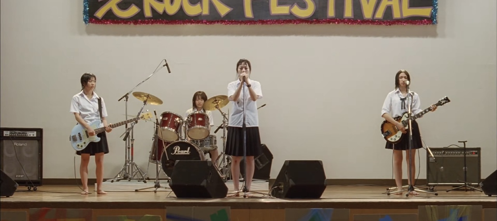
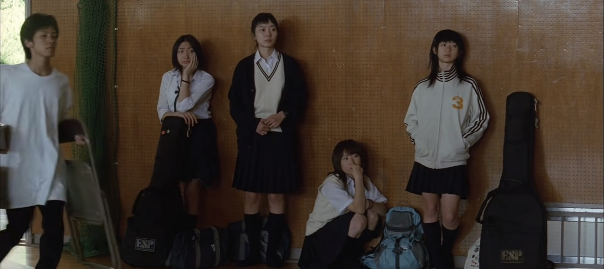
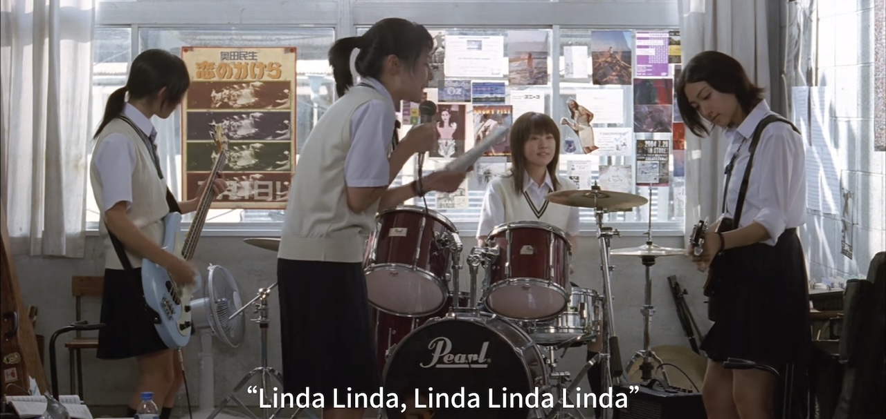
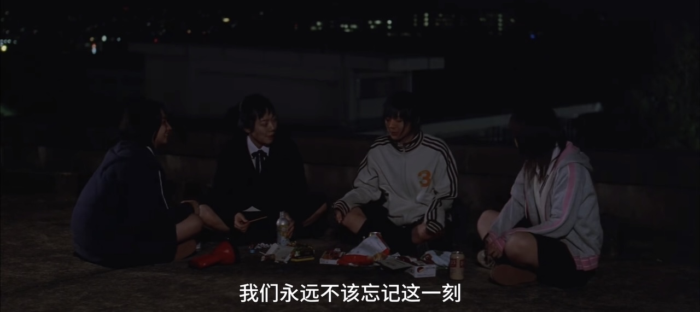

>"如果哪一天让我遇见你 能和你说说话
>
>到时请你一定要告诉我 到底什么是爱"
>
>\- リンダリンダ The Blue Hearts

::: callout-warning
剧透预警！
:::

经常和朋友说

{group="grp"}

{group="grp"}

{group="grp"}

{group="grp"}
---

## [Linda Linda Linda OST](https://music.apple.com/us/album/eiga-linda-linda-linda-original-motion-picture-soundtrack)

::: column-margin
{group="grp"}
:::

电影的OST是the Smashing Pumpkins乐队的吉他手James Iha操刀制作的。梦幻的滑棒吉他和轻柔的扫弦让人想起暖洋洋的春日下午。
